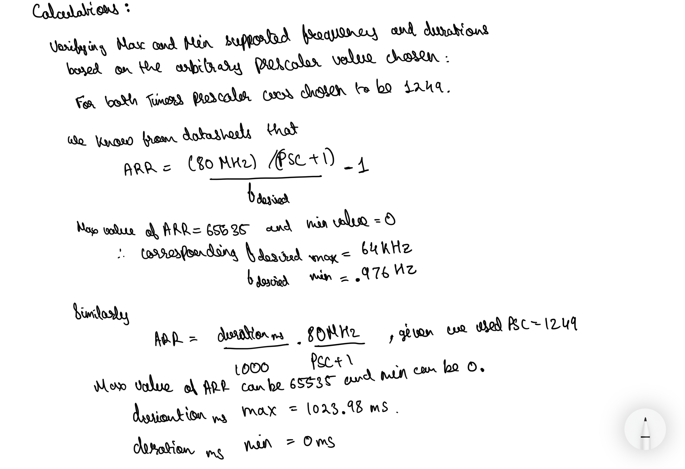
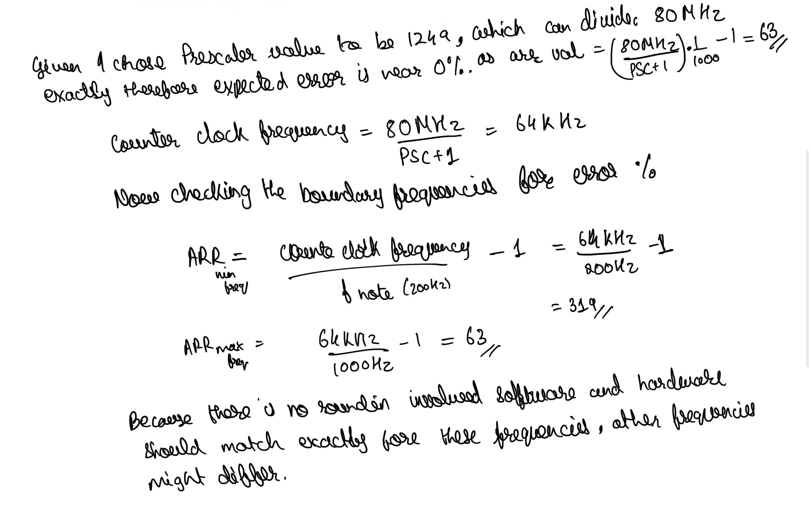
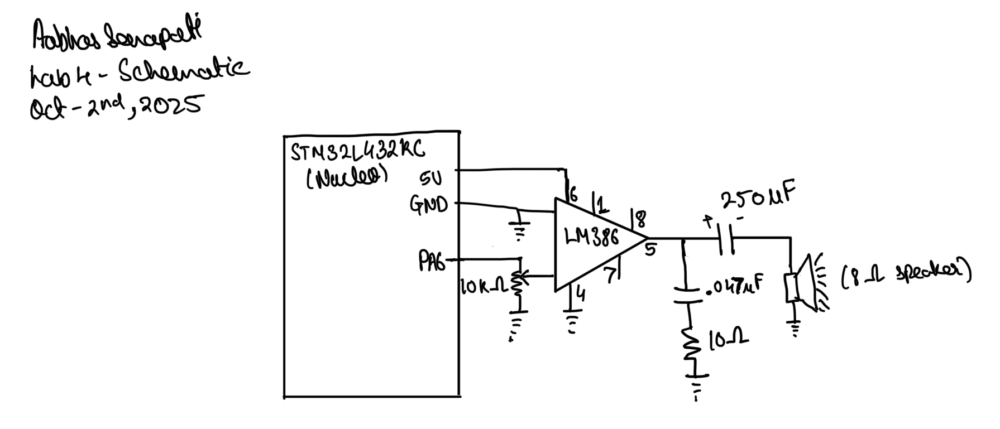
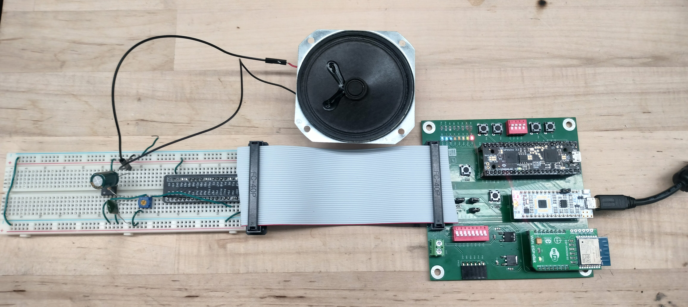
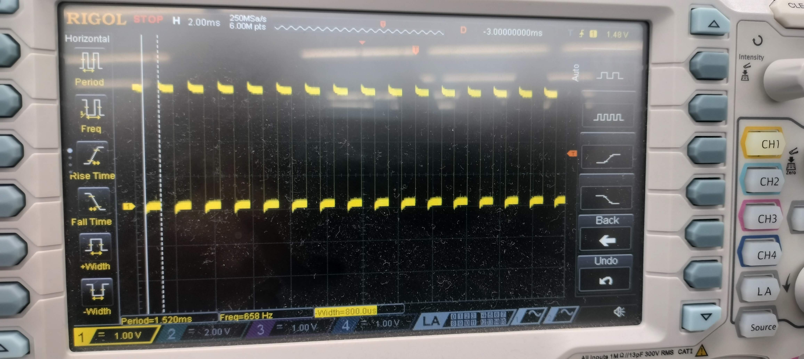
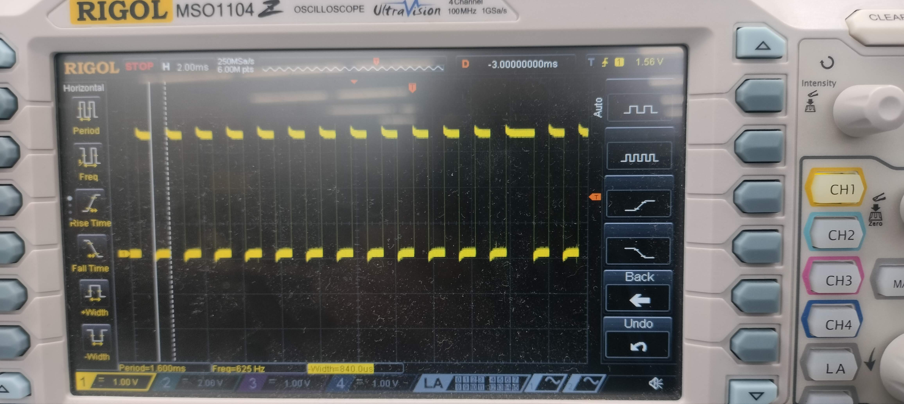
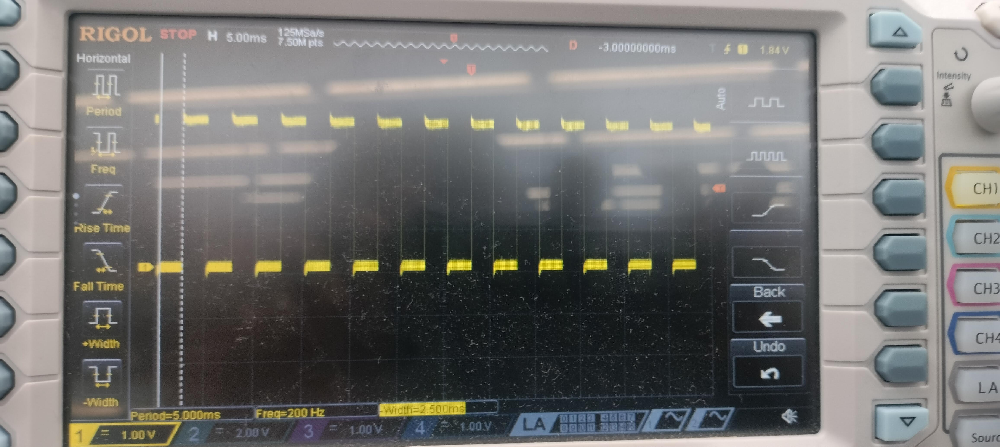
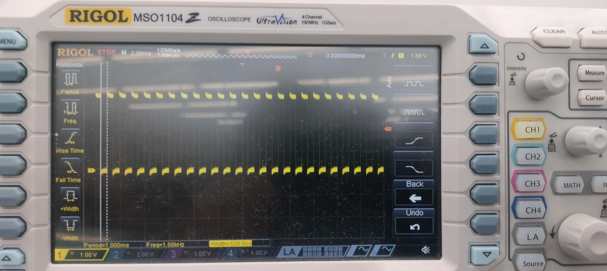
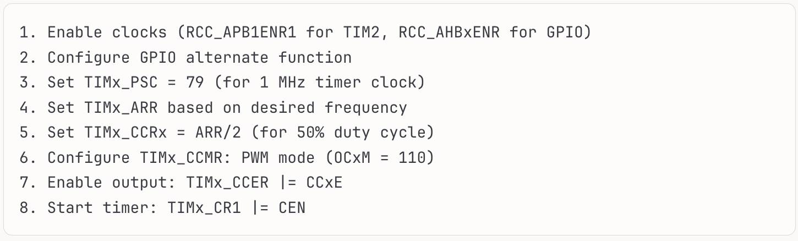
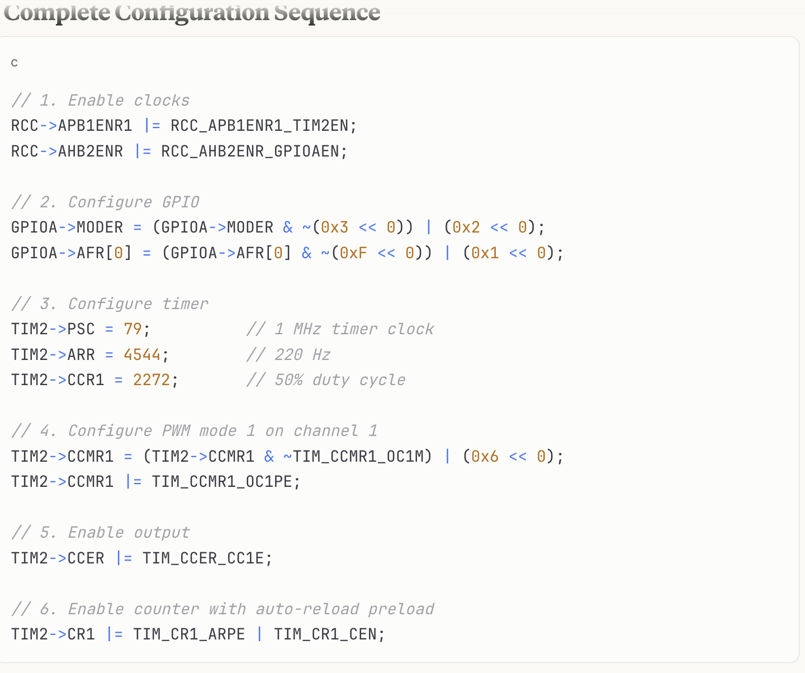

## Introduction

I this lab I try to design a system that can play songs with desired frequencies, as specified, by generating square waves using pwm functionality of timers on the mcu. 

## Design and Testing Methodology
 For the design of this, I used examples tutorial clock setup done in class, to configure Flash, Clock and GPIO on the microcontroller. Once the basic setup worked with blinking LED, I wrote header filers to use the Timer 15 and 16 periperhals, and then wrote c functions to use the onboard timers to delay to hold the pwm signal, and generate a pwm singal of variable frequencies respectively, and then in the main c file, I enabled GPIO A6, configured it with the timer output, and played the desired notes for songs using the c functions, by connecting it to a 8-ohm speaker using an lm386 audio amplifier with a gain of 20. 

 
 My calculations for minimum and maximum frequency that can be played can be found as below. 

## Technical Documentation

### Schematic

### C Code and Header Files

[Can be found on github repository](https://github.com/aabhassenapati/E155-labs/tree/main/lab4/mcu)

## Results and Discussion
I was able to play both the songs the Fur Elise tune that was provided, and the Mary had a Little Lamb song I transposed. I also verified that I was able to get accurate frequencies being played, I verified it for my boundary frequencies of 200 and 1000Hz as specified in the specs, which had no error, while for the frequency values, of first and second note, expected frequency was 659 Hz and 623Hz while I observed it to be 658 Hz and 625 Hz respectively on the oscilloscope, both of which are within 1% error value, and can be accounted due to rounding of values, due to not perfect division of the clock signal.

### Oscilloscope Waveform and Frequency Verification

## Conclusion
 I was able to succesfully achieve all the goals for this lab to play the desired songs using the timers on microcontroller. I spent about 15 hours on this lab. It was a good experience learning to use a reference manual and datasheet to be able to drive and use any microcontroll periperhals we might want to use.

## AI Prototype 

Upon entering the given prompt the initial AI generated a response that suggested using TIM 2, but also suggested that other Timers like 15, and 16 could also be used, and then gave me a rough draft plan for how to approach for TIM2, upon providing the reference manual it was able to even better analyze and provide more detailed information what registers need to be enabled. But there are other things that it doesn't consider like every gpio might not be avialable to us in our pinout etc, so while AI would be great tool to scan and search through reference manual, it would be usable much better when being dealt with by someone who knows what their hardware is, and things that AI could not consider. Seems like this would definitely accelerate the process of going through a reference manual and datasheet, while it might miss some specifics, which might require human in the loop.

