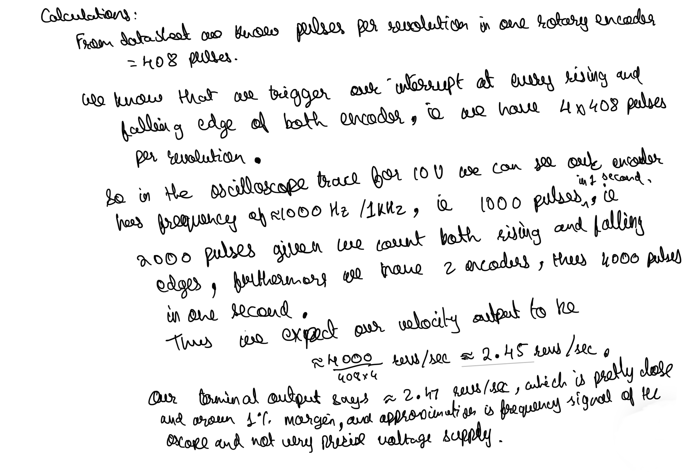
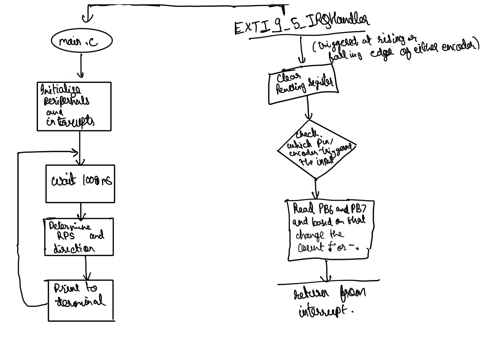
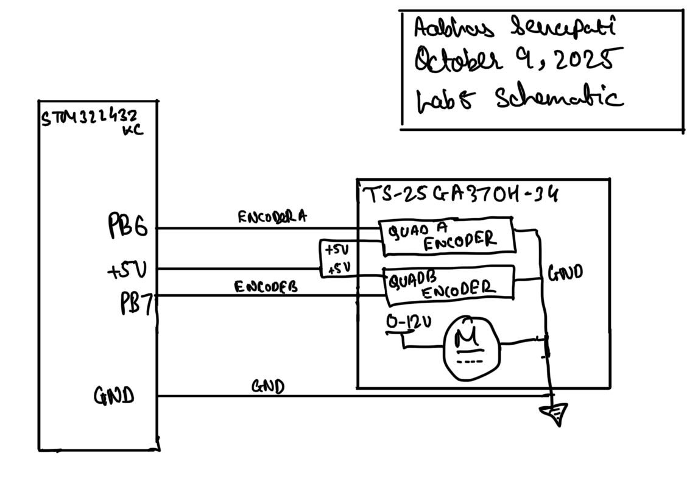
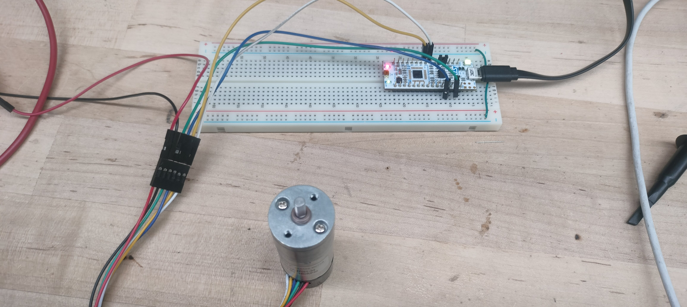
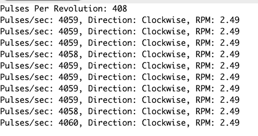
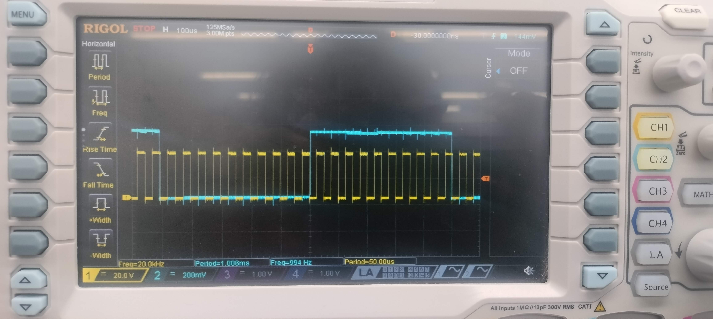
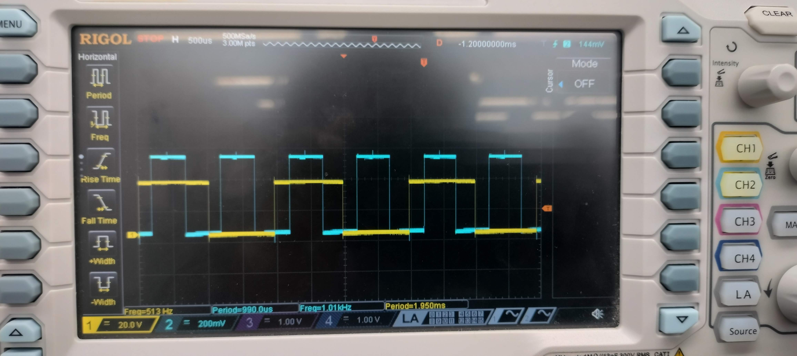
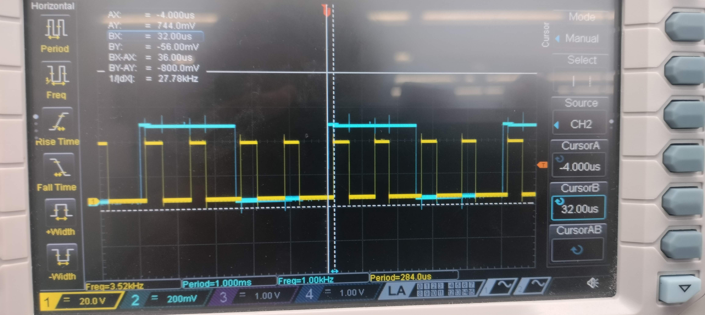
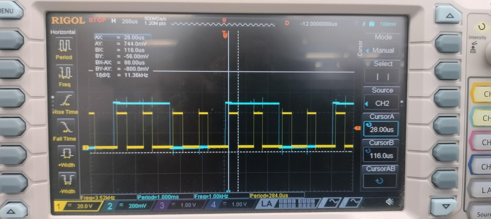

## Introduction

In this lab I try to design a system that can measure the speed of a motor using rotary encoder to trigger event interrupts on the mcu. 

## Design and Testing Methodology
 For the design of this, I used examples interrupt tutorial done in class, to configure Interrupt, Timers, Flash, Clock and GPIO on the microcontroller, I used those libraries given to us to further develop my design. Once the basic setup worked with button interrupt and the LED, I wrote interrupt handlers for Encoder A and Encoder B to check for direction of the rotation, and also calculate the speed based on the number of pulses I measure every second.

 
 My calculations for verifying the pulses measured and the revolutions per second output by the device. 

## Technical Documentation

### Flowchart

### Schematic

### C Code and Header Files

[Can be found on github repository](https://github.com/aabhassenapati/E155-labs/tree/main/lab5/mcu)

## Results and Discussion
I was able to measure the speed of the rotoary encoder very accurately and able to display it on the debug terminal, I also verified that I was able to read all the edges from the encoders using oscilloscope traces and printing out my count values.

Here, in the traces for polling we can see that with an empty while loop the polling frequency is around 20kHz, meanwhile out encoder signal at 10V (high speed) is about 1kHz, given we are samling much faster than 1kHz, we would be able to easily read all the encoder pulses, and determine th velocity, but we also see with a little more complex implementation of leaving our loop as is where it checks for the counter values, and also prints values, and other executions, the polling frequency drops down to around 500Hz, which is slower than our encoder signal and thus would lead to aliassing of our signal and reading incorrect velocity. Meanwhile, in case of our interrupts, we see they have a latency around 30 usecs, and a duration about around 90us, which implies they would not be able to detect a signal that triggers less than every 120 usecs, i.e. approximately 8kHz, implying that we should be fine using our interrupts for our signals which are at max around 1.5kHz, and interrupts can trigger again way faster, and thus should be able to detect every edge correctly, and give a accurate velocity reading. This is also confirmed with out accurate measurement of rev/sec using interrupts. While intterupts our great for this application, this comparison suggests that they might have limitations at very very high frequency sampling just like polling methods, furthermore, at such high frquency interrupts could also not only miss edges like polling but also disrupt communication protocols, etc. Therefore based on application this is an important design choice to consider.

### Oscilloscope traces for Sampling Frequency Verification

## Conclusion
 I was able to succesfully achieve all the goals for this lab to measure all of the desired speeds of motor using rotary encoder and display it, and verified it to be correct, and compared it to polling as well. I spent about 10 hours on this lab. It was a good experience using the existing headers and libraries for this lab, and then just implementing my design, as the main focus of this lab. Also being able to comapre different approaches like polling vs intterrupts was helpful to learn benefits and limitations for these different approaches.

## AI Prototype 

Upon entering the given prompt the initial AI generated a response, which used pins that were not 5V tolerant, and also was using timers in encoder mode to get the design to work, but this had limitations especially with which pins can be used, then I used it to give it feedback about the constrainsts and also details about pulses per revolution based on our encoder, and then it was able to incorporate it to its design, and choose appropriate pins, which would work. I think it shows that while AI is a good tool, you need to have the knowledge of your system and design to use it to its fullest capabilities.

