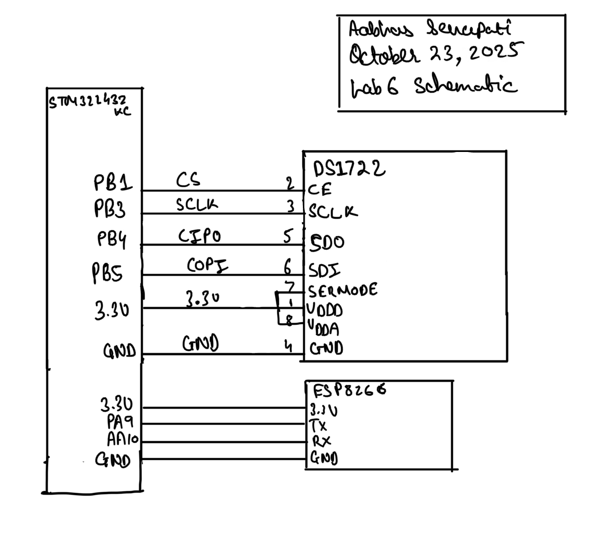
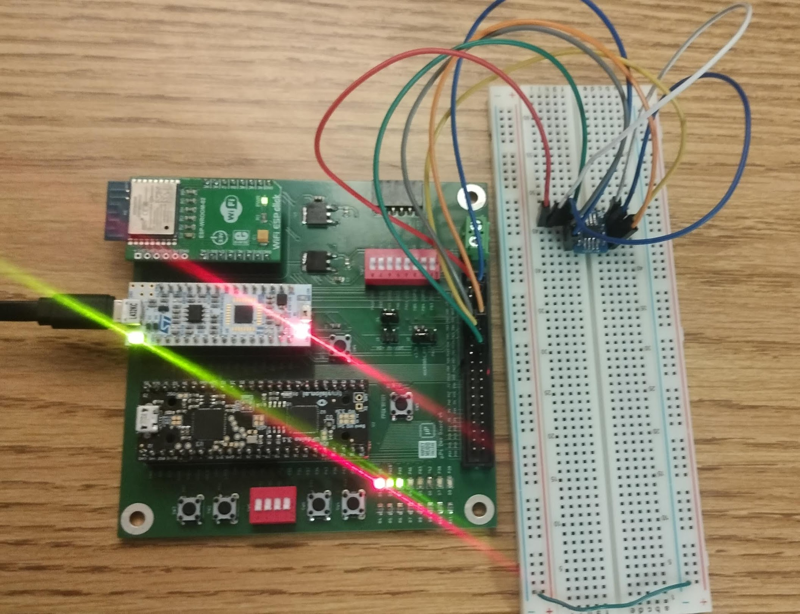
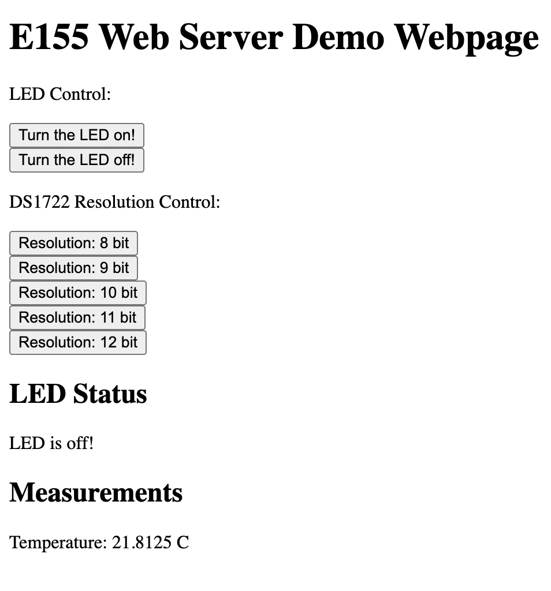
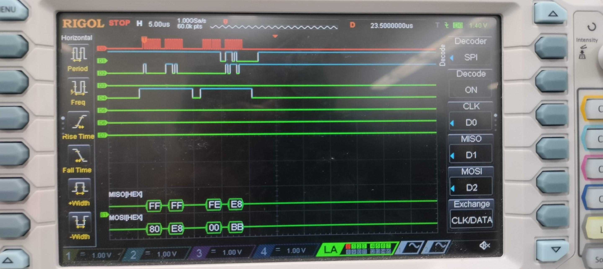
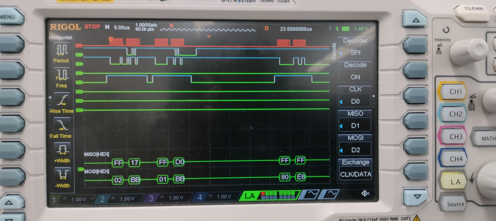

## Introduction

In this lab I try to design a system that can measure temperature from DS1722 sensor over SPI, and send it to ESP8266 over UART for local website hosting the data. 

## Design and Testing Methodology
 For the design of this, I used examples basic USART tutorial done in class, to configure USART, Timers, Flash, Clock and GPIO on the microcontroller, I used those libraries given to us to further develop my design. Once the basic setup worked with website hosting and the LED control, I wrote the SPI library and header files using the datasheet and reference manual, then using the DS1722 datasheet I wrote the functions DS1722 temperature sensor to configure, and read data from it and send that data to ESP8266 upon request by user.

## Technical Documentation

### Schematic

### C Code and Header Files

[Can be found on github repository](https://github.com/aabhassenapati/E155-labs/tree/main/lab6/mcu)

## Results and Discussion
After configuring the SPI on MCU, and assigning pins for SPI to DS1722, and configuring the config register on it, I was able to read the temperature from the DS1722 sensor, after I configured the desired registers over SPI for resolution using the user input buttons on webpage, and then send it back to ESP8266, and also I was able to verify my SPI transactions using a logic analyser available in the lab.

### Logic Analyser Traces for SPI transaction Verification

## Conclusion
 I was able to succesfully achieve all the goals for this lab to measure all range of different temperatures, in correct units accounting for the negative sign as well. I spent about 15 hours on this lab. It was a good experience using a communication protocol as the main focus of this lab, also I found it really helpful to learn how to use a logic analyzer for debugging our hardware and software setup. Overall it was a very fun lab.

## AI Prototype 

Upon entering the given prompt the initial AI generated a response a rough webpage, but upon specifying more details about how it should be it made it a lot better interface, that could be tested, and it worked, although it used some emojis which lead to wierd characters showing up. For the SPI code, while overall it geenrated pretty decent code, it missed on some specifics which made the code not work, also did not consider hardware pin availability and stuff into consideration, and that UART is also using those pins, which made code not to work.

